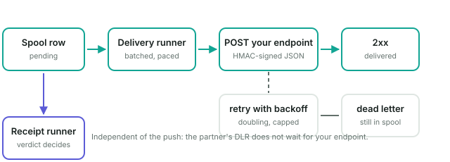
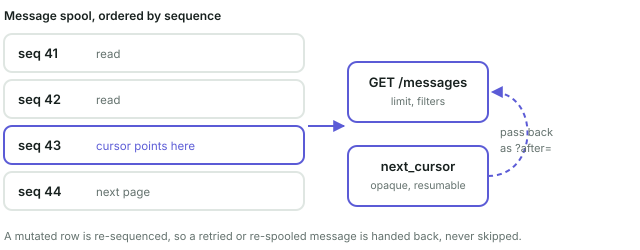

# Receiving terminated messages

When Synevyr is the **destination** rather than a forwarder — a partner binds to
you and submits, and your own application is what the message is for — the
message is handled by a **termination connector**. This document is the contract
for getting that content into your application.

For the operator-facing walkthrough of the same material, the console's
education center carries it as three lessons (**Get terminated messages to your
application**, **Push messages to your service over HTTP**, **Pull messages from
the spool**) with the same figures.

## The two paths, and the one that does not exist


Every terminated message is decoded, reassembled and written to the **message
spool** before any sink runs. The connector's `delivery` setting only decides who
takes it from there:

| Sink | Who initiates | Use when |
| --- | --- | --- |
| `http-push` | the gateway POSTs to you | you want messages as they arrive and can expose an endpoint |
| `pull` | your application GETs from us | you cannot expose an inbound endpoint, or want to control your own rate |
| `both` | push primary, pull as backfill | production: push for latency, pull to recover anything missed while you were down |
| `none` | nobody | the spool is the record; you read it in the console |

Because both sinks read the same spool rows, a failed push is recoverable by
pulling — which is what makes `both` a real setting rather than redundancy.

**There is no broker or Redis fan-out**, and it is not an oversight. Consuming
the gateway's queues directly is what the retired `smsget-jasmin-sms-queues`
service did, and it is precisely the coupling the termination connector exists to
remove. The decision is recorded in
[`docs/plans/021-mt-termination-connector.md`](../plans/021-mt-termination-connector.md).

Retention is **24 hours by default** (`termination_connectors.retention_hours`).
The spool holds decoded message content — often OTP bodies — so this is a breach
surface control, not housekeeping. Do not treat it as a message warehouse.

## Push: `http-push`



### Configuring it

On the termination connector (console: **Termination → Termination
connectors**; config: `termination_connectors.connectors[].delivery`):

| Field | Meaning |
| --- | --- |
| `endpoint` | Absolute `http`/`https` URL. Empty disables push — that is the pull-only deployment. |
| `format` | `json` (default) or `legacy`. |
| `secret` | HMAC key. **Empty omits the signature header entirely** rather than signing with an empty key. |
| `timeout` | Bounds one attempt. Default 10s. |
| `max_attempts` | Bounded, never unlimited. A message retried forever is one nobody ever looks at. |
| `backoff`, `backoff_cap` | First retry interval, doubling to the cap. |

To try it before your own service exists, use a webhook testing service such as
[webhook.site](https://webhook.site): open it, copy the unique URL it hands you,
and set that as `endpoint`. Every POST arrives with its full body and headers.
**Treat that URL as a secret while you use it** — anyone holding it can read your
message content — so point only test traffic at it, never a production connector.

### Request headers

These are part of the wire contract; the spellings cannot change without
breaking every integration.

| Header | Meaning |
| --- | --- |
| `X-Synevyr-Message-Id` | The gateway message id, and **the idempotency key**: every retry of the same message repeats it unchanged. |
| `X-Synevyr-Attempt` | 1-based attempt number. |
| `X-Synevyr-Timestamp` | Unix seconds, signed alongside the body so a captured request cannot be replayed indefinitely. |
| `X-Synevyr-Signature` | `sha256=` plus the hex HMAC over the timestamp and body. |

User-Agent is `Synevyr gateway/1.0 terminationDeliverySink`, distinct from the MO
thrower's, so the two paths are separable in your access log.

Verify the signature before trusting the body, and dedupe on the message id.

### Body (`format: json`)

```json
{
  "message_id": "f1c48d95-00a1-439e-b0fc-43385d750208",
  "connector":  "terminate-local",
  "partner":    "smppuser",
  "from":       "NETFLIX",
  "to":         "380671234567",
  "text":       "your code is 63125",
  "raw_hex":    "796f757220636f6465206973203633313235",
  "dcs":        0,
  "encoding":   "utf-8",
  "parts":      1,
  "received_at": "2026-07-31T03:25:06.942Z",
  "verdict":    "delivrd"
}
```

`raw_hex` is the undecoded bytes, so you can re-decode yourself if you ever
disagree with our decoding.

`format: legacy` instead mirrors the old Jasmin thrower and requires your
endpoint to reply with a body that is exactly `ACK/Jasmin` — see
[`callbacks.md`](callbacks.md).

### Responding

A **2xx** marks the message delivered and the gateway stops. Return it only once
you have committed the message; a 2xx you cannot honour is a lost message.

Anything else is retried with doubling backoff up to `max_attempts`, after which
the message is **dead-lettered**: still readable in the spool and in the console,
just no longer retried. Failures are classified — transport (never landed),
status (non-2xx), not-acknowledged (legacy mode), unreadable response.

> **The receipt does not wait for you.** The partner's DLR is decided by the
> connector's verdict and sent by a separate runner, so a message can be
> `DELIVRD` to the partner and simultaneously undelivered to your application.
> That is deliberate — delivery to you is a durability problem, not a receipt
> problem — but it means **monitoring the dead-letter state is your job**. The
> partner will never report it.

## Pull: `GET /messages`



The pull API rides the existing **REST listener** (default port 8080), not the
admin plane: it is the partner's endpoint, not an operator one.

### Authentication

A **scoped read token**, never the admin token. Create one in the console
(**Termination → Read tokens**) or with `msgconsumer -a` in jCli. A token names
the termination connectors it may read and whether it may see message text; the
secret is shown once and cannot be recovered, because the service stores only a
SHA-256 proof of it.

```console
$ curl -H "Authorization: Bearer synmsg_..." \
    "http://gateway:8080/messages?limit=50"
```

### Query parameters

None of these can widen your scope. The token decides what exists; these only
narrow it.

| Parameter | Type | Meaning |
| --- | --- | --- |
| `limit` | integer | Page size. |
| `after` | opaque string | Resume from a previous response's `next_cursor`. |
| `connector` | string | Restrict to one connector already in your token's scope. |
| `delivery_state` | `pending` \| `delivered` \| `failed` \| `dead` | Filter on push-delivery outcome. |
| `received_from` | RFC 3339 | Lower bound on receipt time. |
| `received_to` | RFC 3339 | Upper bound on receipt time. |

### Response

```json
{
  "messages": [
    {
      "message_id": "f1c48d95-00a1-439e-b0fc-43385d750208",
      "connector": "terminate-local",
      "partner": "smppuser",
      "from": "1111",
      "to": "99991234567",
      "text": "your code is 63125",
      "raw_hex": "796f757220636f6465206973203633313235",
      "dcs": 0,
      "encoding": "utf-8",
      "parts": 1,
      "received_at": "2026-07-31T03:25:06.942Z",
      "verdict": "delivrd",
      "delivery_state": "pending",
      "delivery_attempts": 0
    }
  ],
  "next_cursor": "eyJ2IjoxLCJzZXEiOjR9"
}
```

Same shape as the push payload, plus the two delivery fields that only mean
something for a spooled row. `Cache-Control: no-store` and `Vary: Authorization`
are set: OTP bodies must not be held by an intermediary.

### Paging

Pass `next_cursor` back as `?after=`. Its absence means you have reached the end.

> **Do not page on `received_at`.** It looks equivalent to the cursor and is not.
> The cursor encodes a sequence the store **re-allocates whenever a row changes**,
> so a multipart message reassembled late, or a row re-spooled after a broker
> redelivery, is handed back to you. Paging on a timestamp your reader has
> already passed silently skips exactly those messages — and they are
> disproportionately the interesting ones.

## Operator visibility

- **Termination → Messages** lists the spool. Metadata by default; opening one
  message reveals its text and is recorded as a reveal against your operator
  name, so "who read message content" stays answerable.
- **Termination → Read tokens** shows each credential's read activity — reads,
  messages returned, denials, and last use. A token with **no reads** is the row
  worth noticing: either the integration never shipped, or the credential is
  sitting somewhere nobody is watching.
- `scripts/dev.sh spool` and `scripts/dev.sh messages` drive both ends locally.
