# The Synevyr learning path

- **Date:** 2026-07-30
- **Status:** active
- **Summary:** The written twin of the console's education center — the whole
  curriculum in order, with the schema for every concept, worked examples, and
  the local surprises a general SMPP tutorial will not tell you.

Read this if you are new to the platform, or new to SMS. It is the same
curriculum the admin console teaches at
<http://127.0.0.1:8404/learn>, in the same order and with the same figures — the
figures are literally the same files, rendered from one set of React components
so the two cannot drift.

If you want to *do* rather than *understand* first, go to
[getting-started.md](getting-started.md) and come back. Nothing here assumes you
have run anything.

**Part 1 — Understand the network** is protocol and domain knowledge. It is not
specific to this gateway and it does not become obsolete when you change
vendors. Read it once, in order; each lesson uses the previous one's vocabulary.

**Part 2 — Operate the gateway** is this platform. It is in the order you
actually do things: see the box, connect upstream, decide who may send, send,
receive, terminate, bill, then the sharp tools and recovery.

---

# Part 1 — Understand the network

## 1.1 SMPP in one picture

**SMPP** (Short Message Peer-to-Peer) is the session protocol between an
application and a mobile operator or aggregator. It runs over a long-lived TCP
connection, not over HTTP request/response, and that single fact explains most of
its ergonomics.

Two roles, and they are fixed:

| Role | Full name | Who it is |
| --- | --- | --- |
| **ESME** | External Short Messaging Entity | the **application** side — anything that connects *in* to send or receive |
| **SMSC** | Short Message Service Centre | the **network** side — the operator or aggregator that accepts messages |

The roles are about *who connects to whom*, not about who is the customer. This
is where almost every SMPP conversation goes wrong, because both sides say
"client" and mean opposite things.

This gateway plays **both** roles, at the same time, on different ports:

- As an **ESME**, it connects out to your carrier. That is an *SMPP client
  connector* (`smppc`), and the carrier is the SMSC.
- As an **SMSC**, it accepts connections in from your customers. That is the
  *SMPP server* (`smpps`), and your customer is the ESME.

So "the connector is bound" and "the customer is bound" are two different
sessions in two different directions, and confusing them costs an afternoon.

## 1.2 Binds and sessions

Before any message moves, the ESME sends a **bind** PDU and the SMSC answers. The
bind carries a `system_id` (username), `password`, and optionally a
`system_type`. It also *chooses a direction*, and that choice is the thing people
get wrong.

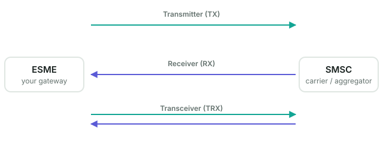

| Bind mode | PDU | The ESME may… | Use it when |
| --- | --- | --- | --- |
| **transmitter** | `bind_transmitter` | send `submit_sm` only | you only ever send, and receipts go somewhere else entirely |
| **receiver** | `bind_receiver` | receive `deliver_sm` only | you only ever collect inbound traffic and receipts |
| **transceiver** | `bind_transceiver` | both, on one session | almost always — one TCP session, one credential, both directions |

**Transceiver is the modern default.** Transmitter and receiver are a legacy of
the days when the two directions were separately provisioned; a pair of them
gives you two sessions to keep alive, two things to reconnect, and a whole class
of "the DLRs stopped but sending still works" incidents that a transceiver simply
cannot have.

> **Local behaviour worth knowing.** A **receiver**-bound account on this gateway
> is excluded from MT routing and does not consume submits — it is a receive-only
> account by construction, not by convention. If you bind a customer as receiver
> and then wonder why their submits are refused, that is why.

**A bound session is not a healthy session.** TCP will happily hold a socket open
that no longer carries anything. `enquire_link` is the protocol's heartbeat: each
side sends it on an idle timer and expects a response. If it goes unanswered the
session is torn down and rebuilt. When someone says "the bind is up but nothing
is flowing", `enquire_link` is the first thing to check.

## 1.3 MT, MO and delivery receipts

Three flows, and mixing up their names is the single most common source of
confusion in this domain.

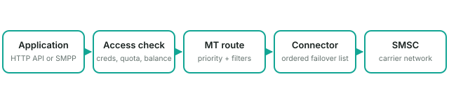

**MT — Mobile Terminated.** A message travelling *toward* a handset. It
**terminates** at the mobile. This is the direction you are in when you send an
OTP, a marketing blast, or an alert. On the wire it is a `submit_sm` PDU. "MT" is
named from the *handset's* point of view, which is why it feels backwards: you
are sending, but the name describes where it ends.

**MO — Mobile Originated.** A message *from* a handset. It **originates** at the
mobile. A customer replying STOP, or texting a shortcode. On the wire it arrives
as a `deliver_sm`.

**DLR — Delivery Receipt.** A status report about an earlier MT message: did it
reach the handset, is it still trying, did it expire. Also a `deliver_sm` on the
wire — the *same PDU type as an MO* — which is exactly why they get conflated.

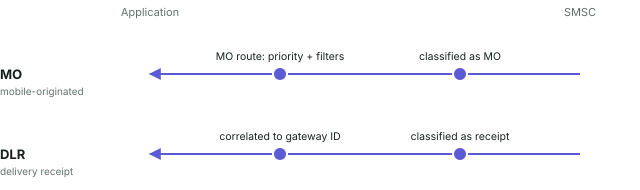

An MO and a DLR look alike on the wire and are classified immediately on arrival,
after which they never share a code path again. An MO continues into MO-route
matching; a DLR is correlated back to the gateway message id stored at submit
time and delivered by a separate worker that never consults the MO route table.

### Receipts have levels, and the level changes what you get

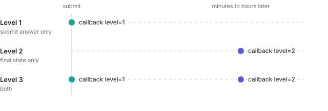

| Level | You are told | Meaning |
| --- | --- | --- |
| **1** | the SMSC accepted the submit | your message was *taken*, nothing more |
| **2** | the final carrier receipt | delivered, expired, undeliverable — the real answer |
| **3** | both | acceptance now, the truth later |

Level 1 arrives in milliseconds and proves almost nothing about delivery. Level 2
can arrive minutes or hours later, or never. **A message can be accepted and
never delivered**, and if you only ever asked for level 1 you will never find
out. Most integration disappointments are level-1 optimism.

## 1.4 Addresses, TON and NPI

An SMS address is not just digits. It carries two type fields that tell the
network how to interpret it.

**TON — Type Of Number.**

| TON | Name | Example |
| --- | --- | --- |
| 0 | Unknown | let the network decide |
| 1 | International | `380671234567` — full country code, no `+` |
| 2 | National | a number in the local numbering plan |
| 5 | **Alphanumeric** | `NETFLIX` — a brand name as the sender |

**NPI — Numbering Plan Indicator.** Usually `1` (ISDN/E.164) for real numbers,
`0` (unknown) for alphanumeric senders.

The pair that matters most in practice: **an alphanumeric sender is TON 5, NPI 0,
and is capped at 11 characters.** Longer is silently truncated or rejected
depending on the carrier. And an alphanumeric sender cannot receive a reply —
there is no number to reply to — so if you need two-way traffic you need a real
number or a shortcode.

Carriers frequently **override** the sender address regardless of what you set,
for regulatory reasons. Your message arriving with a different sender than you
specified is usually the carrier, not a bug in your integration.

## 1.5 Encoding and segmentation

An SMS is not a string; it is a fixed number of octets, and the encoding decides
how many characters fit.

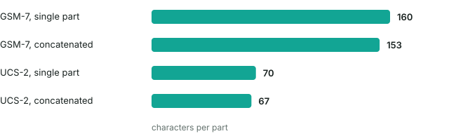

| Encoding | `data_coding` | Single message | Per segment when concatenated |
| --- | --- | --- | --- |
| GSM 7-bit | 0 | **160** chars | **153** |
| UCS-2 (any non-GSM character) | 8 | **70** chars | **67** |

The cliff is brutal and it is worth understanding exactly: **one** character
outside the GSM alphabet — a Cyrillic letter, a curly quote your CMS inserted, an
emoji — switches the *whole message* to UCS-2 and cuts capacity from 160 to 70.
A 160-character message becomes three segments instead of one.

Segments are billed individually. See §2.11.

Concatenation is carried either in a **UDH** (User Data Header) prefixed to the
body, or in **SAR** optional parameters. Both encode the same three facts:
reference number, total parts, this part's index. The receiving handset
reassembles. If parts arrive out of order or one is lost, the handset shows
fragments or nothing.

## 1.6 Delivery receipts in practice

The receipt body is, notoriously, **not** a structured field. It is a text blob
in a conventional format that most carriers approximately follow:

```
id:0123456789 sub:001 dlvrd:001 submit date:2607311200 done date:2607311201 stat:DELIVRD err:000 text:your code is
```

The fields that matter:

- **`id`** — the *SMSC's* message id, which is how you correlate the receipt back
  to your submit. It is what `submit_sm_resp` returned.
- **`stat`** — the final state. `DELIVRD`, `EXPIRED`, `UNDELIV`, `REJECTD`,
  `ACCEPTD`, `UNKNOWN`, `DELETED`.
- **`err`** — a carrier-specific error code. Not standardised; ask your carrier.

**The id format is a compatibility minefield.** Some carriers return decimal,
some hexadecimal, some pad, some do not. A receipt whose id you cannot match to a
submit is a receipt you cannot act on, and it is the most common DLR integration
failure. See [runbooks/dlrs-not-arriving.md](runbooks/dlrs-not-arriving.md).

## 1.7 Reading an SMPP status code

Every SMPP response carries a `command_status`. `0` is `ESME_ROK` — accepted.
Everything else is a refusal, and the refusal tells you which layer to fix.

| Status | Name | What it actually means |
| --- | --- | --- |
| `0x00` | `ESME_ROK` | accepted (not delivered — see §1.3) |
| `0x0D` | `ESME_RBINDFAIL` | bind rejected: credentials, or you are bound already |
| `0x0E` | `ESME_RINVPASWD` | wrong password |
| `0x58` | `ESME_RTHROTTLED` | you are sending faster than your allowance — slow down, do not retry harder |
| `0x14` | `ESME_RMSGQFUL` | the SMSC's queue is full — back off |
| `0x0B` | `ESME_RINVDSTADR` | destination address invalid — usually TON/NPI or formatting |
| `0x45` | `ESME_RSUBMITFAIL` | generic submit failure; ask the carrier |

`ESME_RTHROTTLED` is the one worth internalising: it is not an error to retry
immediately. Retrying harder on a throttle is how a temporary slowdown becomes a
disconnection.

## 1.8 Throughput, throttling and retries

Throughput is a **contract**, expressed in messages per second, and both sides
enforce it. Exceed it and you get `ESME_RTHROTTLED`, or a disconnect if you keep
going.

`window_size` is the other half: how many submits may be in flight without a
response. A window of 1 is safe and slow — one round trip per message. A larger
window pipelines, at the cost of more state to reconcile when the session drops.

When a session drops, the rule is: **reconnect with backoff, do not hammer**. A
carrier that dropped you because you were too fast will drop you again, faster,
if your reconnect loop is tight.

## 1.9 How SMS traffic is charged

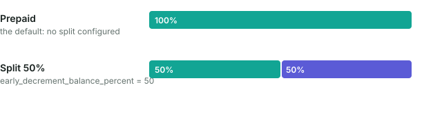

Charging happens at **two** moments, and which one applies decides what a
rejected message costs you.

- **The rate comes from the route**, not from the customer and not from the
  destination directly — whichever MT route the message matched.
- **Every segment is priced separately.** A three-part message costs three times
  the rate. This is where §1.5 becomes a billing question.
- **Prepaid takes it all at submit.** The balance falls when the message is
  admitted, before the carrier has answered.
- **A split defers part of it**: a configured percentage at submit, the rest only
  once the SMSC accepts, applied by an idempotent ledger.

> The early share is **not returned** when the SMSC rejects the message. A
> rejected part keeps its submit-time charge and simply never incurs the later
> one.

---

# Part 2 — Operate the gateway

## 2.1 The objects, and how they relate

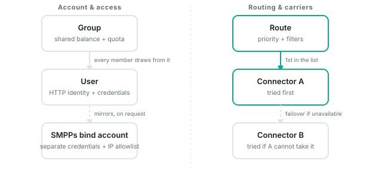

Everything in Part 2 is one of these:

| Object | What it is |
| --- | --- |
| **User** | a customer account that may submit. Has credentials, a group, a balance, quota. |
| **Group** | a ceiling shared by several users. |
| **SMPPc connector** | an outbound session to a carrier. This gateway is the ESME. |
| **SMPPs bind** | an inbound account your customer binds to. This gateway is the SMSC. |
| **Termination connector** | MT traffic that **stops here**: decoded, spooled, handed to your application. |
| **MT route** | picks a connector for an outbound message, by priority and filters. |
| **MO route** | picks a destination for an inbound message. |
| **Filter** | a reusable match condition a route embeds. |
| **Interceptor** | a script that rewrites or rejects a message in flight. |

## 2.2 Read the control room

Start every investigation at the dashboard, not at the thing someone reported.
Most "the gateway is broken" reports are one connector, one route, or one
customer's quota.

1. **Readiness first.** `/health` reports PostgreSQL, the broker and each
   required connector's bind state. If a dependency is down, nothing below it is
   worth debugging.
2. **Then connector state.** A connector has a *desired* state (what you asked
   for) and an *observed* state (what the session is doing). They diverge when
   credentials, the network or reconnect backoff get in the way.

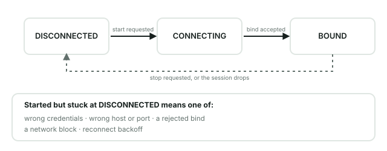

## 2.3 Connect an upstream SMSC

An SMPPc connector is this gateway acting as an ESME toward your carrier. It
needs host, port, `system_id`, password, and a bind mode (§1.2 — use
transceiver).

The two settings people get wrong:

- **`submit_sm_throughput`** must be at or below what the carrier contracted. Set
  it higher and you will be throttled or disconnected (§1.8).
- **Reconnect delays** (`con_loss_delay`, `con_fail_delay`) — leave them sane.
  A tight reconnect loop against a carrier that dropped you is how a blip becomes
  a ban.

A connector must be **started** as well as created. A created-but-stopped
connector is invisible to routing.

## 2.4 Model customer access

A **user** is who may submit. Credentials, a group, and — if you charge — a
balance and quota.

Do this *before* routing, because a route that points at a connector nobody may
reach is not testable, and a user with no group has no ceiling.

## 2.5 Build the outbound path (MT routing)

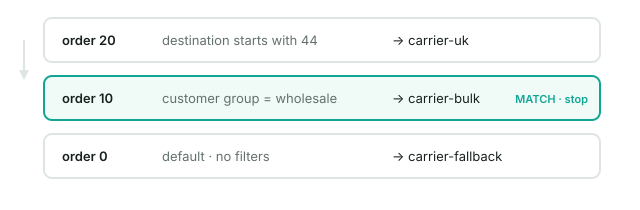

An MT route answers: *this message, which connector?*

- Routes are evaluated by **order, highest first**. The first match wins.
- A **default route** (order 0) catches everything unmatched. Without one,
  unmatched traffic is rejected.
- **Filters** narrow a route — destination prefix, source, content, user, group,
  time.

> **Local behaviour worth knowing.** Destination filters are **anchored** —
> matched with `re.match` semantics, so the pattern must match from the start of
> the address. To match a substring, write `.*X`, not `X`. A filter that silently
> matches nothing is usually this.

## 2.6 Host a customer's SMPP bind

Now the other direction: this gateway as the SMSC, your customer as the ESME
(§1.1). Create an SMPPs account with a `system_id` and password.

> **SMPP 3.4 caps the bind password at 8 characters** — it is a COctetString of
> 9 octets including the null terminator. A longer password cannot be encoded by
> a conformant ESME, so the bind fails *before* authentication is attempted, and
> the error you get will not say "password too long". Generate 8 characters, and
> keep the listener reachable only by known peers, because 8 characters is weak.

## 2.7 Deliver inbound traffic (MO routing)

An MO route answers: *this inbound message, where does it go?* Either an HTTP
webhook (the **MO webhooks** library) or a customer's SMPPs bind.

Your webhook must return **HTTP 2xx and a body that is exactly `ACK/Jasmin`**
after trimming. A 2xx with an empty body, `OK`, or JSON is a *failure* and will
be retried. This is inherited compatibility behaviour, not a preference — see
[api/callbacks.md](api/callbacks.md).

## 2.8 Reuse filters and destinations

Saved filters and MO webhooks are libraries. A route embeds a **copy** of the
resolved filter at the time you build the route — editing the library entry
afterwards does not retroactively change routes that already copied it. Rebuild
the route to pick up a change.

## 2.9 Terminate traffic here

When *you* are the destination — a partner submits to you and your own
application consumes the content — you want a **termination connector**, not an
upstream SMSC.

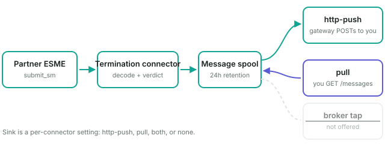

Full contract, every field and parameter: **[api/messages.md](api/messages.md)**.
The short version:

- Every terminated message is decoded, reassembled and **spooled** (24h default)
  before any sink runs.
- **`http-push`** — the gateway POSTs each message to your endpoint, HMAC-signed,
  with bounded retries and a dead-letter state.
- **`pull`** — your application fetches over a cursor API with a scoped read
  token.
- **`both`** — push for latency, pull to backfill what was missed.
- There is **no broker fan-out**, deliberately.

> The partner's receipt is decided by the connector's **verdict** and sent by a
> separate runner. It does **not** wait for your application. A message can be
> `DELIVRD` to the partner and undelivered to you at the same time — so watching
> the dead-letter state is your job.

## 2.10 Answer "what happened to my message?"

The order that actually resolves it fastest:

1. **Did we accept it?** The submit log and the CDR say whether the front door
   took it.
2. **Which route did it match?** A message that went to the wrong carrier matched
   a route you did not expect (§2.5 — check anchoring).
3. **Did the carrier accept it?** `submit_sm_resp` status (§1.7).
4. **Did a receipt come back?** And at which level (§1.3) — if you only asked for
   level 1, there is nothing more to find.

## 2.11 Billing

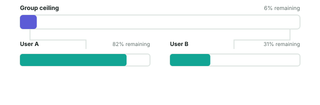

Accounts, usage and statements. The mechanics are §1.9; the console surfaces are
under **Billing**. The rate is the route's, and every segment is priced.

## 2.12 Interceptors

A script that runs in the message path and may rewrite or reject a message.
Powerful and sharp: it is **code executing on the gateway host**, in the hot
path. A slow interceptor is a slow gateway. Interceptor editing is off unless
`admin.allow_interceptor_editing` is set, for that reason.

## 2.13 Operate and recover safely

- Config-owned objects (declared in `gateway.json`) can be started and stopped
  from the console but **not edited or deleted** there — a deletion the next
  restart undoes is worse than a refusal.
- PostgreSQL is the durability boundary. Back it up
  ([../deploy/BACKUP.md](../deploy/BACKUP.md)).
- The runbooks in [runbooks/](runbooks/) are written for the incident, not for
  the reader: start there when something is actually broken.

---

## Where to go next

| You want to | Read |
| --- | --- |
| Run it, right now | [getting-started.md](getting-started.md) |
| Send over HTTP | [api/http.md](api/http.md) |
| Bind your own ESME | [api/smpp.md](api/smpp.md) |
| Receive DLRs and MO | [api/callbacks.md](api/callbacks.md) |
| Receive terminated messages | [api/messages.md](api/messages.md) |
| Deploy for real | [operations/new-deployment.md](operations/new-deployment.md) |
| Fix something broken | [runbooks/](runbooks/) |
| Look up a term | [glossary.md](glossary.md) |
