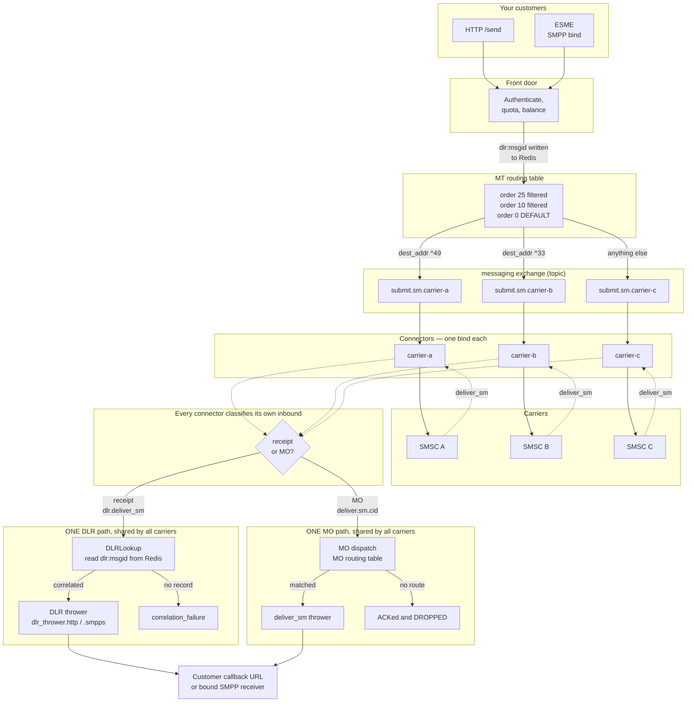

# Connecting several carriers, and how their receipts reach one DLR service

- **Date:** 2026-07-29
- **Status:** active
- **Summary:** How to attach more than one carrier, how outbound traffic is
  distributed across them, and why every carrier's delivery receipts converge on
  a single correlation path regardless of which carrier produced them.

This answers two separate questions that are easy to conflate:

1. **How do several carriers coexist?** Each is an independent connector with its
   own bind, its own queue and its own counters. Adding one does not touch the
   others.
2. **How do their receipts all reach the DLR service?** They converge on one
   shared path, because correlation is keyed by **message id**, not by connector.
   There is exactly one DLR pipeline no matter how many carriers you attach.

## The whole picture



Read the solid lines as outbound (MT) and the dotted lines as inbound. The two
boxes labelled "ONE ... path" are the answer to the second question: they are
singular. Three carriers, or thirty, feed the same two pipelines.

## Adding a carrier

A carrier is a connector plus at least one route. Nothing else.

```bash
# 1. The connector: how to bind to them. POST creates, and starts it by default.
curl -sS -X POST localhost:8080/admin/connectors \
  -H "Authorization: Bearer $ADMIN_TOKEN" \
  -H 'Content-Type: application/json' \
  -d '{
        "config": {
          "cid": "carrier-b",
          "host": "smsc-b.example.net", "port": 2775,
          "system_id": "ourid", "password": "8charmax",
          "bind": "transceiver",
          "submit_sm_throughput": 20,
          "src_ton": 5, "src_npi": 0
        },
        "start": true
      }'

# 2. The route: which traffic goes to them. The order in the path and in the
#    body must agree, or the request is rejected.
curl -sS -X PUT localhost:8080/admin/routes/20 \
  -H "Authorization: Bearer $ADMIN_TOKEN" \
  -H 'Content-Type: application/json' \
  -d '{
        "order": 20,
        "connector_ids": ["carrier-b"],
        "rate": 0.012,
        "filters": [{"type": "destination_addr", "pattern": "^33"}]
      }'
```

Both are live immediately: the connector starts and binds, and the route is
swapped into the table atomically. No restart, and no effect on traffic already
flowing to other carriers.

The same two objects exist in the web console (**Connectors** and **MT routes**)
and in jCli (`smppccm`, `mtrouter`). All three surfaces write the same store.

Note the asymmetry: **MO routes are not on the bearer-token admin API.** They are
managed through the console (`/api/mo-routes`, session-authenticated) or jCli
(`morouter`), not through `/admin/`. If you are scripting provisioning, MT routes
and connectors can be driven with a token but MO routes currently cannot.

### One bind is one connector

If a carrier gives you two binds — commonly a transmitter and a receiver, or two
transceivers for capacity — that is **two connectors**, with two cids. They then
appear as two independent rows everywhere: two queues, two sets of counters, two
throughput settings. Give them related cids (`carrier-b-1`, `carrier-b-2`) and
put both in one route's connector pool.

Gotcha: an SMPP 3.4 bind password is capped at **8 characters** by the protocol's
`COctetString` field, so a longer generated secret cannot bind at all. This is
the protocol, not a Synevyr limit.

## How outbound traffic is distributed

The MT routing table is scanned **highest order first**. The first route whose
filters all match wins; order 0 is the default and is tried last.

```
order 25   dest_addr ^49        →  carrier-a          Germany to A
order 20   dest_addr ^33        →  carrier-b          France to B
order 10   user = wholesale-x   →  carrier-c          one customer pinned
order  0   DEFAULT              →  carrier-c          everything else
```

A route may name a **pool** of connectors instead of one. The runtime picks the
**first available in the listed order** — not at random. So list them in
preference order, and treat the pool as failover with a stable primary rather
than as load balancing.

> The route form in the web console offers a "random" selection mode that the
> runtime does not implement. It is a known UI defect
> ([plan 018 step 5](../plans/018-admin-plane-and-onboarding.md)); until it is
> corrected, the selection is always ordered.

Two consequences worth knowing before you design a routing plan:

- **A route with filters is never a safety net.** If nothing matches, the submit
  is refused at the front door with `no route matched` — the customer sees the
  error immediately. That is the desirable failure: loud and attributable.
- **Per-connector throughput is the pacing control**, set on the connector, not
  the route. A carrier that throttles you (`ESME_RTHROTTLED`) shows up as
  `throttling_error_count` on that connector, which is separated from other
  submit failures precisely because the response is different: slow down, rather
  than fix the message.

## Why all carriers share one DLR service

This is the part that surprises people, so it is worth stating plainly:
**correlation does not care which carrier the receipt came from.**

When a submit is accepted, the gateway writes a Redis record keyed by the
message id it gave the customer:

```
dlr:<our-msgid>   →  { the customer's callback URL,
                       the requested dlr-level,
                       the carrier's own message id,
                       expiry }
```

When any carrier later sends a `deliver_sm`, the connector that receives it
classifies it (`internal/core/smppc/deliver.go:89`):

- a **receipt** (it carries `receipted_message_id`/`message_state`, or its body
  parses as a receipt) is published to routing key `dlr.deliver_sm`;
- anything else is an **MO**, published to `deliver.sm.<cid>`.

DLRLookup consumes `dlr.*` — a single queue, bound once — reads
`dlr:<msgid>` and forwards to `dlr_thrower.http` or `dlr_thrower.smpps`. The
thrower performs the customer callback.

So the flow is **carrier → (any connector) → one lookup → one thrower →
customer**. Adding a carrier adds no DLR configuration, no new queue, and no new
callback wiring. That is by design, and it is why receipt handling does not get
more complicated as you attach more carriers.

Three practical consequences:

- **A receipt can arrive on a different bind than the submit went out on**, and
  it still correlates, because the lookup is by message id. Some carriers do
  exactly this when they give you a separate receiver bind.
- **A receipt whose id has no Redis record is counted as
  `correlation_failure`,** not silently discarded. Usual causes: the record
  expired (the customer's `dlr-expiry`), the submit was never accepted, or the
  carrier mangled the id. `SynevyrDLRCorrelationFailures` alerts on three in ten
  minutes.
- **Levels are a customer choice, not a carrier one.** `dlr-level=1` is the
  submit response only, `2` is the carrier receipt only, `3` is both. A carrier
  that never sends receipts silently produces no level-2 callback — the customer
  sees an accepted submit and then nothing, which is a carrier quality question,
  not a gateway fault. See [`../api/callbacks.md`](../api/callbacks.md).

## Inbound messages from several carriers

MO traffic converges the same way, through one MO routing table. It differs from
MT in the dimension it filters on: MO routes filter on the **source connector
id** — which carrier delivered it — as well as on content.

```
order 20   from carrier-a, content ^STOP  →  https://you/optout
order 10   from carrier-b                 →  https://you/inbound-b
order  0   DEFAULT                        →  https://you/inbound
```

**Have a default MO route.** This is the one asymmetry in the system that can
lose messages:

| Direction | No route matched |
|---|---|
| MT | Refused at the front door. The sender gets an error and knows. |
| MO | **Acknowledged to the carrier and discarded.** They record a delivery; you have nothing. |

Because that failure is silent by design (it is the reference behaviour and is
kept), it is instrumented rather than changed:

- the gateway **warns at startup** when no default MO route is configured, and
  again if the last one is deleted at runtime;
- the console's MO routes page shows a warning banner when none is present;
- every drop increments `synevyr_mo_total{outcome="dropped"}`, and
  `SynevyrInboundMessagesDropped` pages on it. A second outcome,
  `dropped_unsupported`, is separated because it needs a different fix: it means
  a reassembled multipart MO matched a route whose connector is not HTTP.

Successful dispatches increment `synevyr_mo_total{outcome="routed"}`, so the drop
count is a ratio rather than a bare number.

## Checking a multi-carrier setup

```bash
# Which carrier a destination would actually take — read the table top-down.
curl -sS localhost:8080/admin/routes -H "Authorization: Bearer $ADMIN_TOKEN"

# One connector's bind state and traffic counters.
curl -sS localhost:8080/admin/connectors/carrier-b -H "Authorization: Bearer $ADMIN_TOKEN"

# Per-carrier receipt and inbound health, on the admin listener.
curl -sS localhost:8080/metrics/prometheus | grep -E 'synevyr_(mo|dlr)_total'
```

Per-connector counters are also on the console's dashboard (`/api/stats`), which
is session-authenticated rather than token-authenticated — use the browser for
that one, or the two `/admin/` calls above from a script.

If one carrier's traffic stops while others continue, the cause is almost always
that connector's bind or its throughput setting, not routing — routing failures
are refusals at the front door, which the customer reports, whereas a dead bind
is a queue that stops draining. `synevyr_connector_bound` distinguishes them
immediately.

## See also

- [`running-the-platform.md`](running-the-platform.md) — onboarding customers and
  carriers step by step.
- [`../api/callbacks.md`](../api/callbacks.md) — what your endpoint must return
  (`ACK/Jasmin`, exactly).
- [`monitoring.md`](monitoring.md) — which of these series are live and which are
  still inert.
- [`../runbooks/dlrs-not-arriving.md`](../runbooks/dlrs-not-arriving.md) — when
  receipts stop.
