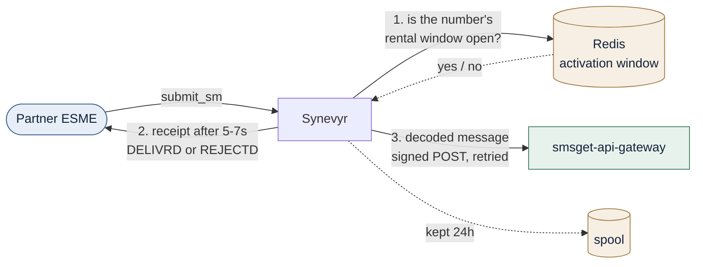
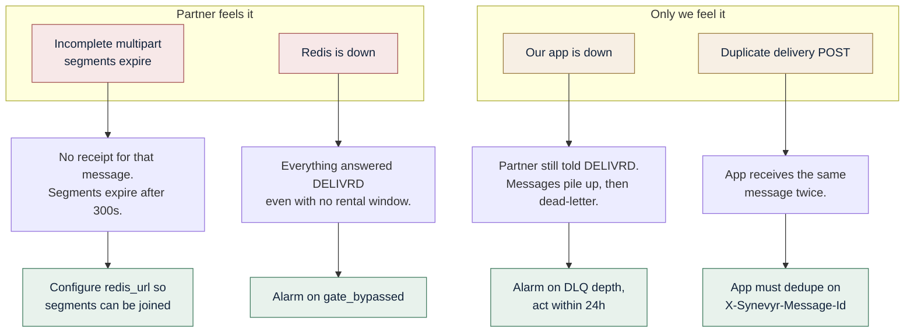

# Terminating traffic safely: what can go wrong, and who feels it

- **Date:** 2026-07-30
- **Status:** active
- **Summary:** The known limits of the MT termination connector, drawn simply, with the guardrail for each one — so neither we nor a partner is surprised.
- **Related:** [plan 021](../plans/021-mt-termination-connector.md), [ADR-008](../adr/008-mt-termination-connector.md), [running-the-platform.md](running-the-platform.md)

## The one thing to understand first

There are **two independent promises**, and they are not the same promise.



**The receipt answers "was the rental window open?" — not "did our app get the
message?"** That is deliberate, it is what the legacy fake SMSC did, and it is
why a partner can be told `DELIVRD` while our application is down. The delivery
is made durable separately: retried, then parked in a dead-letter queue, never
dropped.

If you want the two promises fused — the partner only hears DELIVRD when the app
actually took the message — that is the `http-inline` mode, designed but not
built. It costs putting our app on the partner's submit path.

## What can go wrong



## The list, with what to do about each

| # | What happens | Who feels it | Guardrail | Fixed by |
|---|---|---|---|---|
| 1 | ~~**A concatenated (long) message is refused.**~~ **Closed 2026-07-30.** UDH and SAR segments are now reassembled into one message, producing one spool row, one receipt and one delivery. Two conditions still refuse: a connector with no `redis_url` (nowhere to hold a partial message), and a group that never completes, whose segments expire after 300 s. | **Partner**, only in those two cases. | Configure `redis_url` on any connector that may receive long messages. A partner who sends segments and then stops still gets no receipt for that message. | Plan step 4 — done |
| 2 | **Redis unreachable → everything is accepted.** The gate fails open on purpose: rejecting real traffic during an infrastructure blip is worse. Every message is answered `DELIVRD` regardless of rental window. | **Partner** hears DELIVRD; **our app** receives messages for numbers with no active rental. | Alarm on `synevyr_termination_gate_bypass_total` (see **What to watch**). Every bypassed decision is also flagged in the spool row and the decision trail, so the blast radius is queryable afterwards. | Behaviour is inherited on purpose. The counter exists as of plan step 11; no alert rule ships yet. |
| 3 | **Our app is down.** The receipt is unaffected — the window was open, so the partner is told DELIVRD. Deliveries retry 5 times over ~10 minutes, then dead-letter. | **Us.** The partner sees nothing wrong. | Alarm on `synevyr_termination_dead_letter_depth` (see **What to watch**). **Act within 24 h**: the spool prunes on the retention window, and a dead-lettered message older than that is no longer replayable. | Working as designed. Counter exists as of plan step 11; the 24 h cliff is still a decision to revisit. |
| 4 | **The same message delivered twice.** The delivery scan takes no lease, so two gateway processes — or a restart mid-batch — can POST the same row twice. | **Our app**, if it does not dedupe. | The contract already carries `X-Synevyr-Message-Id`, identical across every retry. The app must treat it as the dedupe key. | A lease on the delivery scan (not yet built) |
| 5 | **A duplicate receipt.** If publishing a batch of receipts outlives the 30 s lease, the next pass re-claims those rows and publishes again. | **Partner** — two receipts for one message. | Bounded by deployment: the HA fence is taken *before* the gateway starts, so only the active node runs the runners, and each loop is sequential. The remaining window is a slow broker during one batch. | Re-checking the lease before each publish (not yet built) |
| 6 | **A rejected OTP is not refunded.** Inherited billing behaviour: the early charge stands even when the receipt says REJECTD. | **Partner**, commercially. | Say so in the commercial terms. It is not new, but it is now our behaviour rather than the old stack's. | Deliberate parity |
| 7 | **A leaked pull token reads messages until it is revoked.** A message consumer token fetches decoded content over `GET /messages` for whatever connectors its scope names. It is not the admin token and cannot change anything, but within its scope it reads OTP bodies. | **Partners on the scoped connectors.** | Revoke it — console → Message consumers → Revoke, or `POST /admin/message-consumers/{id}/revoke`. It takes effect on the next request, and the blast radius is queryable: every read wrote an audit row naming that consumer id, the scope applied and how many rows it took. Give each application its own consumer so revoking one does not stop the others. | Working as designed |

| 8 | **A stitched message gets one receipt, not one per `submit_sm`.** The plain-split stitch releases a group on a timer and receipts it once. Same defect class as the multipart one corrected on 2026-07-30, not yet closed. | **Partner**, if they request a receipt per part. | The stitch is off by default and per connector. Do not enable it for a partner who sets `registered_delivery` on every segment. | Giving a stitched group its own identity — not yet built |

## The two rules that prevent most of this

1. **Run one active gateway.** Multi-active is unsupported ([ADR-005](../adr/005-active-passive-postgres-fencing.md)), and it is what keeps items 4 and 5 to a narrow window rather than a routine occurrence. A second active node would duplicate both deliveries and receipts.
2. **Make the app idempotent on `X-Synevyr-Message-Id`.** It is one line in the receiving handler and it removes item 4 entirely, including the redelivery cases no lease can prevent — a crash between "POST succeeded" and "row marked delivered" will always re-POST.

## What to watch

**All four are now metrics, not queries.** They are on the private admin
listener's `/metrics/prometheus`, alongside the rest of
[monitoring.md](monitoring.md):

```console
curl -fsS http://127.0.0.1:${GATEWAY_ADMIN_API_PORT:-8405}/metrics/prometheus | \
  grep synevyr_termination
```

No alert rules ship for them yet. These are the thresholds to start from; each
is a starting point to tighten against your own traffic, not a tuned value.

| What | Series | Suggested alarm | Why that threshold |
|---|---|---|---|
| **Gate bypasses** | `synevyr_termination_gate_bypass_total` | **Critical:** `increase(...[5m]) > 0`, for 2m | Zero is the only correct value, so the threshold is "any". The 2m hold rides out a single Redis reconnect without paging; a genuine outage keeps producing them. This is the most valuable of the four — every other signal looks healthy while it happens, because the partner is told DELIVRD and the message is delivered normally. |
| **Dead-letter depth** | `synevyr_termination_dead_letter_depth` | **Warning:** `> 0` for 15m. **Critical:** `> 0` for 4h | Two levels because the clock that matters is the 24 h retention prune, after which a dead-lettered message is no longer replayable. Warning gives a working day's attention; critical at 4h still leaves 20h of margin to replay. Do not alarm at 0m: one dead-letter during a downstream deploy is normal and clears on replay. |
| **Spool row count** | `synevyr_termination_spool_rows` | **Warning:** above 5× the connector's normal steady-state, for 30m | There is no absolute number: the steady state is arrival rate × 24 h, which differs per partner. Growth well past it means deliveries are not settling. At today's ~10 msg/s that is roughly 860 k rows steady-state; at the plan's 200 msg/s target, 17 M. Set the multiple, not the count. |
| **Receipts owed but not sent** | `synevyr_termination_receipts_overdue` | **Critical:** `> 0` for 5m | A receipt is due 5–7 s after submit and the runner sweeps every second, so a non-zero reading that survives 5 minutes means the receipt runner is not draining — partners are waiting and will not be told anything. Below 5m it is just the normal delay window being observed mid-flight. |

Two properties of these numbers worth knowing before building a panel:

- The last three are **polled every 10 s**, not counted at each change. They fall
  as well as rise — a replayed message leaves the dead-letter gauge, a pruned row
  leaves the spool gauge — which is exactly why they are recounted rather than
  derived from events.
- A connector with no rows at all reports `0`, not nothing. A connector that has
  never carried traffic reports no sample, so alert on the series being present
  and non-zero, never on `absent()` alone.

## Pulling messages instead of being pushed them

An application can fetch decoded messages from the spool rather than (or as well
as) receiving the signed POST. It is the same listener the REST API is on — no
new port — and it pages by an **opaque cursor**, never by a time window:

It is served on both views of that listener — the public HTTP front door and
the standalone REST daemon (`rest_api.listen_address`) — so use whichever
address the partner's application already reaches:

```console
curl -fsS -H "Authorization: Bearer ${SYNEVYR_MESSAGE_TOKEN}" \
  "http://${GATEWAY_HTTP_ADDR}/messages?after=${CURSOR}&limit=100"
```

Three things to tell whoever runs the consuming application:

1. **Keep the `next_cursor` and send it back.** Do not rebuild the position from
   a clock. A delivery that is retried re-enters the spool with its original
   `received_at`, already behind where a time-based reader had reached, so a
   `now - N seconds` query loses it permanently — and one missed poll is a
   permanent hole. The cursor hands both back.
2. **An empty `messages` array means "nothing new", and nothing else.** A page is
   never short because rows were hidden: the token's scope is part of the SQL
   query, so pages are dense over the traffic that consumer is entitled to. If it
   asks for a connector outside its scope it gets `403`, not an empty page.
3. **`include_text: false` omits `text` and `raw_hex` entirely.** The keys are
   absent, not null and not `""`. An application that treats a missing key as an
   empty message will silently record every OTP as blank.

Each token is created once in the console (or on `/admin/message-consumers`) and
**shown once**. It is not recoverable — the gateway stores a SHA-256 proof of it,
the same way it stores a durable REST batch credential. If it is lost or leaked,
revoke the consumer and create another; see item 7 above.

For the blast radius **after** a gate bypass — which numbers were accepted blind,
and what each was told — use the decision trail rather than the counter. It is a
query over the spool, described in
[monitoring.md](monitoring.md#the-termination-decision-trail); the counter tells
you it happened, the trail tells you to whom.
