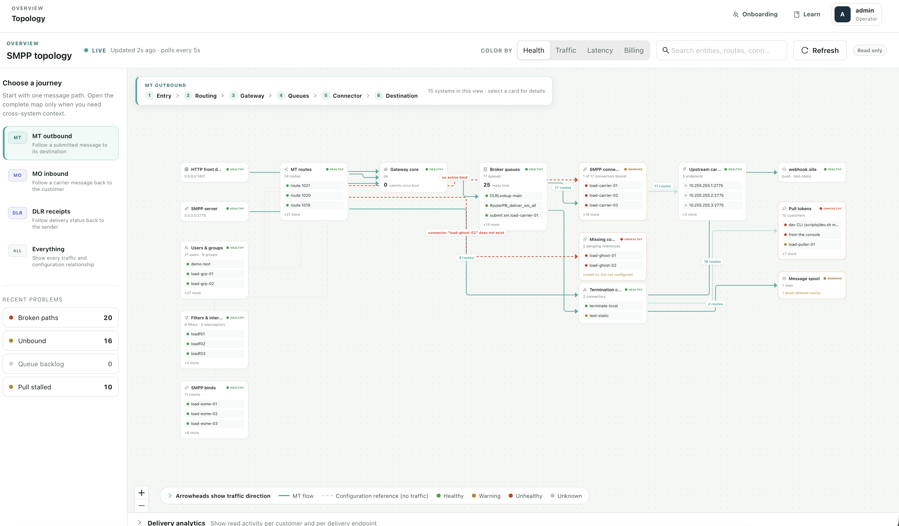

# Topology design and positioning audit

Date: 2026-08-01  
Scope: the current topology screen only—composition, spacing, card hierarchy, edge routing, framing, and accessibility. This audit proposes no new product features, data, or navigation.



## Executive verdict

General health: **good and now usable, about 7.5/10 visually**. The earlier overlap and arrow ambiguity are materially improved. The remaining weakness is no longer basic correctness; it is hierarchy. The layout gives supporting configuration almost the same spatial authority as live traffic, so the primary journey is scaled down and pushed into the upper part of a much larger graph footprint.

The next pass should make the six-stage message path the visual spine, place configuration-only cards in a compact support band, and frame the graph around overlay-safe space at a legible scale. Those changes should deliver a larger improvement than adding any more decoration or controls.

## Step 1 — MT outbound topology

### What is already strong

1. The left-to-right direction is immediately understandable. Arrowheads, line color, dashed configuration references, and the legend reinforce one another.
2. Cards have a consistent shape and density. Three visible members plus “+N more” gives useful detail without allowing one group to dominate the canvas.
3. Warning and unhealthy cards are easy to locate without turning the whole map red.
4. The journey selector and stage guide reduce the cognitive load of the complete topology.
5. The legend and analytics bar now occupy separate, stable regions and no longer cover each other.
6. The sparse background, restrained borders, and limited palette are appropriate for an operational diagram.

### Primary UX risks

1. **The composition is top- and left-heavy.** The main traffic path occupies a thin band near the top while configuration-only cards form a tall stack at the left. Large lower-center and lower-right areas are unused. Because `fitView` must include the full visible footprint, the useful cards and labels become unnecessarily small.
2. **The primary path and supporting configuration have equal layout weight.** “Users & groups”, “Filters & interceptors”, and “SMPP binds” are context for the path, not sequential traffic stages, but their vertical stack controls the scale of the whole map.
3. **The stage guide is not spatially aligned with the graph.** It describes Entry → Destination but floats as a compact breadcrumb rather than orienting the user to the actual columns below it.
4. **Card identity loses to repeated health state.** Important titles such as “HTTP front door”, “SMPP connectors”, and “Upstream carriers” are truncated while every card repeats a prominent `HEALTHY` label.
5. **Faults are operationally important but subordinate in the rail.** The active journey card is the strongest object, while “Broken paths 20” appears later and with only a small red dot.

### Accessibility risks visible in the design/code

1. The screenshot and source geometry indicate an initial graph scale around 0.6–0.7. At that transform, 13px titles render roughly as 8–9px and 8px state labels roughly as 5px. This is the biggest readability problem, even though WCAG does not define a universal minimum font size.
2. The declared MT stroke (`#12a594`) is approximately 2.85:1 against the canvas and the configuration stroke (`#c7d0cd`) approximately 1.46:1. Meaningful graphical objects should reach 3:1 against adjacent colors; thin anti-aliased paths need extra care. See [W3C non-text contrast](https://www.w3.org/WAI/WCAG22/Understanding/non-text-contrast.html).
3. Cards are visually clickable, but the page opens details only from `onNodeClick`; keyboard activation and an explicit `:focus-visible` treatment need verification. See [W3C keyboard](https://www.w3.org/WAI/WCAG22/Understanding/keyboard.html) and [focus visible](https://www.w3.org/WAI/WCAG22/Understanding/focus-visible.html).
4. At widths below 1200px the inspector is hidden. On this viewport that can happen near 150% browser zoom, causing selected details to disappear instead of reflowing. Diagrams are a two-dimensional exception, but their surrounding controls and detail panels still need to preserve content and function. See [W3C reflow](https://www.w3.org/WAI/WCAG22/Understanding/reflow.html).

## Recommended target composition

```text
Reserved guide band     Entry      Routing      Gateway      Queues      Connector      Carrier      Delivery

Primary traffic spine   HTTP/SMPP → MT routes → Gateway → Broker queues → SMPP conn. → Upstream → Webhook

Support band                         Users/groups  Filters                    SMPP binds

Exception satellites                                                     Missing conn.             Pull / spool
```

The important rule is semantic: cards that carry traffic stay on the primary spine; cards connected only by configuration references live in the support band. Exception cards sit directly below the stage they affect. In the complete-system view, infrastructure remains in its own band above traffic, as already intended.

## Prioritized changes

### Priority 1 — Rebalance the layout around one primary traffic spine

- Center the primary card in each stage on one `spineCenterY` (`y = spineCenterY - cardHeight / 2`) instead of top-aligning cards with very different heights. Align their adjacent-stage traffic ports to that same baseline.
- Give adjacent-stage traffic edges straightness priority; branches leave the spine only after a short straight segment.
- Classify top-level cards by incident edge kind. Cards with only configuration relationships move into a support band and sit near the median column of the traffic cards they configure.
- Limit the support area to one row where possible and two rows at most. Use **40–48px** between the traffic spine and support band and **20–24px** between support cards.
- In the current layout, keep `CARD_WIDTH` at 208px, reduce `COLUMN_GAP` from **96px to a tested range of 56–64px**, `ROW_GAP` from 28px to **20–24px**, and `LANE_GAP` from 72px to **56–64px**. Treat 56px as the lower column-gap limit because route-count badges and separate edge tracks still need room. Change card width only after the new header and routing are measured.

This is a positioning correction, not a new concept. Directed layered layouts are most legible when layering, crossing minimization, placement, and routing all operate on the same model. The current code lets Dagre order one geometry and then imposes different semantic columns afterward. [ELK’s layered-layout documentation](https://eclipse.dev/elk/reference/algorithms/org-eclipse-elk-layered.html) describes the coherent phase model; for this screen, a smaller deterministic fixed-column ordering pass is the lower-risk first step.

### Priority 1 — Make automatic framing preserve legibility and overlay-safe space

- Replace scalar `padding: 0.16` with side-specific safe areas:
  - left/right: **24–32px**
  - top: rendered journey-guide height + **20–24px**
  - bottom: legend/analytics-toggle height + **16–24px**
- Use the same safe area for initial fit, journey changes, inspector changes, and the fit control.
- Target an automatic-fit floor around **0.80–0.85**, validated at the supported viewport sizes. Prefer a small amount of horizontal pan over unreadably small text.
- Do not blindly refit the entire diagram when the inspector opens. Preserve the user’s scale and shift only enough to keep the selected card inside the safe rectangle.

React Flow supports fit padding and fitting a selected node subset, so this can be achieved with the current canvas rather than a new layout engine or UI. See [React Flow `FitViewOptions`](https://reactflow.dev/api-reference/types/fit-view-options).

### Priority 1 — Route relationships as a set, not as unrelated elbows

The current renderer calls `getSmoothStepPath` separately for every edge. It cannot know that another edge, label, or card already occupies the same corridor. The remaining glued segments and crowded arrow endings are therefore structural.

- Inflate card rectangles by an edge-clearance margin, build inter-column corridors, sort visible relationships, and assign a deterministic track to each.
- Route the HTTP and SMPP skip-column paths through explicit upper/lower corridors around the tall MT-routes card. They currently disappear behind that card and re-emerge near Gateway, which makes MT routes appear to emit extra parallel arrows.
- Do not let two different relationships share a collinear segment. Parallel segments should remain visibly separate.
- Reserve different track groups for traffic, faults, and configuration references. Put degraded red paths on the outside exception track so they do not weave through normal traffic.
- Replace the seven percentage ports with dynamic absolute offsets. Terminal spacing should be at least the **14px marker size + 4px clearance = 18px**.
- Keep a straight final approach at least one marker length long before every arrowhead.
- Choose the card side from rectangle geometry; use lane/column direction only as the tie-breaker.
- Treat labels as occupied rectangles. Place them **6–8px** above or below the longest horizontal segment and reject any position that overlaps a node, bend, marker, line, or label.

This follows established object-avoiding orthogonal routing practice, which optimizes connector length/bends while keeping connectors out of unrelated objects. See [Wybrow, Marriott, and Stuckey](https://users.monash.edu/~mwybrow/papers/wybrow-gd-2009.pdf).

### Priority 2 — Give card names priority over repeated healthy state

- Use a fixed two-row header inside the current card geometry:
  - row 1: icon + title, with the full remaining width
  - row 2: sublabel/metric on the left; dot + status text on the right
- Allow the title up to two lines when necessary, while keeping card height deterministic and feeding the measured dimensions back to layout.
- Keep healthy status textual but visually quiet; warnings and unhealthy states retain stronger color and border emphasis.
- Target **13–14px effective title text** and **10–11px effective status/edge-label text** at initial framing. Do not rely on hover-only `title` attributes for identification.

### Priority 2 — Strengthen the operational hierarchy of the left rail

- Move **Recent problems** above journey selection when non-zero problems exist, or at minimum give the problem block equal top-level weight.
- Use a restrained 3px red/amber left accent or lightly tinted background on non-zero problem rows; keep the existing text count.
- Reduce the rail from its wide-screen 264px impression toward **240–248px** if the text still wraps cleanly. Return the reclaimed width to the canvas.
- Keep journey controls immediately below; no new filters or controls are needed.

### Priority 2 — Improve line and secondary-text contrast without increasing visual noise

- Test the existing darker teal `#0f766e` for MT lines; it is about 5.1:1 against the canvas.
- Move configuration/unknown strokes toward approximately `#808d89`, which clears 3:1 while remaining secondary.
- Darken small gray and warning-reason text enough to clear 4.5:1 on its actual background.
- Preserve the current non-color redundancy: arrowheads for direction, dashed configuration/fault patterns, and visible status words.

### Priority 3 — Align the guide and focus order with the journey

- Position the six stage labels from the same column centers used by the cards, or turn the existing guide into a full-width reserved band with those aligned labels. At minimum, align the guide and legend to the same **64px left gutter** and keep the guide to roughly **48–52px** high.
- Emit/focus cards in visual order: column first, then lane and y. Keyboard focus should move Entry → Routing → Gateway → Queues → Connector → Destination instead of following server array order.
- Add a 2–3px visible focus ring and make Enter/Space open the same inspector as pointer selection.
- Preserve the existing inspector at zoomed/narrow widths by reflowing it below or beside the canvas instead of hiding it.

## Why not replace Dagre immediately?

React Flow describes Dagre as a simple, fast option and ELK as much more configurable but substantially more complex. The current graph is small and its semantic columns are already known, so the best first move is to keep the current stack and make ordering, support-band placement, ports, and routing respect those fixed columns. Consider ELK only if the deterministic corridor pass cannot satisfy the acceptance criteria as the graph grows. See [React Flow’s layouting overview](https://reactflow.dev/learn/layouting/layouting).

## Implementation order

1. Support-band classification, primary-spine alignment, and compact spacing.
2. Explicit overlay-safe fit padding and legibility floor.
3. Absolute port spacing and rectangle-based side choice.
4. Global corridor/track routing and label collision handling.
5. Two-row card headers and calmer healthy-state styling.
6. Rail hierarchy, contrast, focus order, and responsive inspector verification.

## Visual acceptance criteria

- At the target 1785×1047 CSS-pixel viewport, every primary card is identifiable without a tooltip.
- The main message journey reads left-to-right as one continuous spine; adjacent stages have zero bends where possible.
- Configuration-only cards occupy a compact support band of no more than two rows.
- Infrastructure is above traffic in the complete view and does not expand journey views unnecessarily.
- No edge enters a non-endpoint card; no two relationships share a collinear segment.
- Parallel tracks have consistent separation and arrow terminals have at least 18px spacing.
- Every arrowhead has a straight final approach at least 14px long.
- No edge label overlaps a card, line, bend, arrowhead, overlay, or another label.
- The journey guide, legend, controls, and analytics toggle never cover a fitted node or label.
- Repeated layout of the same graph produces identical positions and routes.
- At 150–200% browser zoom, selected details remain available and keyboard focus remains visible and unobscured.

## Evidence limits

The audit is based on the supplied MT/Health screenshot, the current topology layout/rendering source, and primary graph-layout/accessibility references. The screenshot shows analytics collapsed and the inspector closed. No live browser DOM, computed transform, keyboard/screen-reader session, forced-colors test, or 150–400% zoom test was available. The scale and contrast figures are source/image-based estimates and should be validated in the running UI; they are not a formal WCAG conformance claim.
