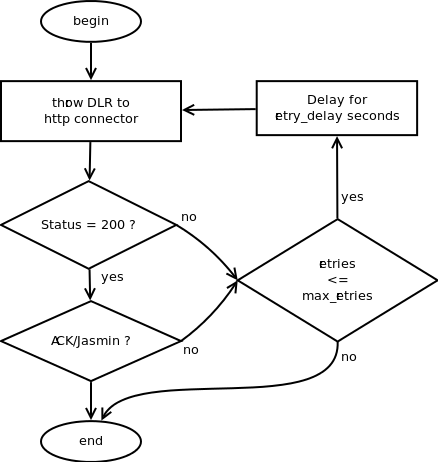
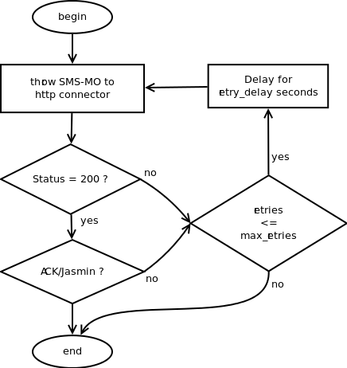

#######################
Using http API: ja-http
#######################

This document is targeted at software designers wishing to integrate SMS messaging as a function 
into their applications, e.g. in connection with WEB-server, unified messaging, information services etc.

Introduction
============
SMS Messages can be transmitted using HTTP protocol, the following requirements must be met to enable the service :

 * You need a Jasmin user account
 * You need sufficient credit on your Jasmin user account
 
Sending SMS-MT
==============

In order to deliver **SMS-MT** messages (**M**\obile **T**\erminated) Data is transferred using **HTTP GET/POST** requests.
The Jasmin gateway accepts requests at the following URL:

http://127.0.0.1:1401/send

.. note:: Host ``127.0.0.1`` and port ``1401`` are default values and configurable in ``/etc/jasmin/jasmin.cfg``.

HTTP Parameters
***************
+------------------+----------------------------------------------+--------------------------------+-----------+--------------------------------------------------------------------+
| Parameter name   | Value/Pattern                                | Example(s)                     | Presence  |Description                                                         |
+==================+==============================================+================================+===========+====================================================================+
| to               | Msisdn with or without international prefix  | +21620203060, 20203060         | Mandatory | Destination address, only one address is supported per request     |
|                  |                                              |                                |           |                                                                    |
+------------------+----------------------------------------------+--------------------------------+-----------+--------------------------------------------------------------------+
| from             | Msisdn with or without international prefix, | +21620203060, 20203060, Jasmin | Optional  | Originating address, In case rewriting of the sender's address is  |
|                  | alphanumeric value                           |                                |           | supported/permitted by the SMS-C used to transmit the message,     |
|                  |                                              |                                |           | this number is transmitted as the originating address.             |
+------------------+----------------------------------------------+--------------------------------+-----------+--------------------------------------------------------------------+
| username         | Text (30 char. max)                          | jasmin_user                    | Mandatory | Username for Jasmin account.                                       |
+------------------+----------------------------------------------+--------------------------------+-----------+--------------------------------------------------------------------+
| password         | Text (30 char. max)                          | jasmin_pass                    | Mandatory | Password for Jasmin account.                                       |
+------------------+----------------------------------------------+--------------------------------+-----------+--------------------------------------------------------------------+
| priority         | 1, 2 or 3                                    | 2                              | Optional  | Default is 1 (lowest priority)                                     |
+------------------+----------------------------------------------+--------------------------------+-----------+--------------------------------------------------------------------+
| content          | Text                                         | Hello world !                  | Mandatory | Content to be sent                                                 |
+------------------+----------------------------------------------+--------------------------------+-----------+--------------------------------------------------------------------+
| dlr              | yes or no                                    | yes                            | Optional  | Default is no (no DLR will be tracked)                             |
+------------------+----------------------------------------------+--------------------------------+-----------+--------------------------------------------------------------------+
| dlr-url          | HTTP(s) URL                                  | http://127.0.0.1/app/dlr.php   |           | If a DLR is requested (dlr = 'yes'), dlr-url MUST be set, if not,  |
|                  |                                              |                                |           | dlr value is reconsidered as 'no'                                  |
+------------------+----------------------------------------------+--------------------------------+-----------+--------------------------------------------------------------------+
| dlr-level        | 1, 2 or 3                                    | 2                              |           | 1: SMS-C level, 2: Terminal level, 3: Both                         |
+------------------+----------------------------------------------+--------------------------------+-----------+--------------------------------------------------------------------+
| dlr-method       | GET or POST                                  | GET                            |           | DLR is transmitted through http to a third party application using |
|                  |                                              |                                |           | GET or POST method.                                                |
+------------------+----------------------------------------------+--------------------------------+-----------+--------------------------------------------------------------------+

Receiving DLR
=============

When requested (through dlr-* fields in SMS-MT http query), a DLR will be sent back to the application url (set in dlr-url) through **HTTP GET/POST** depending on
dlr-method value. 

The receiving end must reply back using a "**200 OK**" status header **and** a body containing an **acknowledgement** of receiving the DLR, if one or both of
these conditions are not met, the DLRThrower service will consider reshipment of the same message if **config/dlr-thrower/max_retries** is not reached.

In order to acknowledge DLR receipt, the receiving end must reply back with **exactly** the following html body content: **ACK/Jasmin**

.. note:: It is very important to acknowledge back each received DLR, this will prevent to receive the same message many times.
.. note:: Reshipment of a message will be delayed for **config/dlr-thrower/retry_delay** seconds.

HTTP Parameters for a level 1 DLR
*********************************
The following parameters are sent to the receiving end (dlr-url) when DLR's dlr-level is 1 (SMS-C level only)

+------------------+--------------------------------------+--------------------------------------+----------+---------------------------------------------+
| Parameter name   | Value/Pattern                        | Example(s)                           | Presence | Description                                 |
+==================+======================================+======================================+==========+=============================================+
| id               | Universally Unique IDentifier (UUID) | 16fd2706-8baf-433b-82eb-8c7fada847da | Always   | Internal Jasmin's gateway message id used   |
|                  |                                      |                                      |          | for tracking messages                       |
+------------------+--------------------------------------+--------------------------------------+----------+---------------------------------------------+
| message_status   | ESME_* SMPP Command status           | ESME_ROK, ESME_RINVNUMDESTS          | Always   | The delivery status                         |
+------------------+--------------------------------------+--------------------------------------+----------+---------------------------------------------+
| level            | 1                                    | 1                                    | Always   | This is a static value indicating the       |
|                  |                                      |                                      |          | dlr-level originally requested              |
+------------------+--------------------------------------+--------------------------------------+----------+---------------------------------------------+

HTTP Parameters for a level 2 or 3 DLR
**************************************
The following parameters are sent to the receiving end (dlr-url) when DLR's dlr-level is 2 or 3 (Terminal level or all levels)

+------------------+--------------------------------------+--------------------------------------+-----------+--------------------------------------------+
| Parameter name   | Value/Pattern                        | Example(s)                           | Presence  | Description                                |
+==================+======================================+======================================+===========+============================================+
| id               | Universally Unique IDentifier (UUID) | 16fd2706-8baf-433b-82eb-8c7fada847da | Always    | Internal Jasmin's gateway message id used  |
|                  |                                      |                                      |           | for tracking messages                      |
+------------------+--------------------------------------+--------------------------------------+-----------+--------------------------------------------+
| id_smsc          | Integer                              | 2567                                 | Optional* | Message id returned from the SMS-C         |
+------------------+--------------------------------------+--------------------------------------+-----------+--------------------------------------------+
| message_status   | ESME_* SMPP Command status or        | ESME_ROK, EXPIRED, ESME_RINVNUMDESTS | Always    | The delivery status                        |
|                  | Delivery Receipt message states:     |                                      |           |                                            |
|                  | DELIVRD, EXPIRED, DELETED, UNDELIV,  |                                      |           |                                            |
|                  | ACCEPTD, UNKNOWN, REJECTD.           |                                      |           |                                            |
+------------------+--------------------------------------+--------------------------------------+-----------+--------------------------------------------+
| level            | 1, 2 or 3                            | 2                                    | Always    | This is a static value indicating the      |
|                  |                                      |                                      |           | dlr-level originally requested             |
+------------------+--------------------------------------+--------------------------------------+-----------+--------------------------------------------+
| subdate          | Date & time format: YYMMDDhhmm       | 1311022338                           | Optional* | The time and date at which the short       |
|                  |                                      |                                      |           | message was submitted                      |
+------------------+--------------------------------------+--------------------------------------+-----------+--------------------------------------------+
| donedate         | Date & time format: YYMMDDhhmm       | 1311022338                           | Optional* | The time and date at which the short       |
|                  |                                      |                                      |           | message reached it's final state           |
+------------------+--------------------------------------+--------------------------------------+-----------+--------------------------------------------+
| sub              | Integer                              | 1                                    | Optional* | Number of short messages originally        |
|                  |                                      |                                      |           | submitted. This is only relevant when the  |
|                  |                                      |                                      |           | original message was submitted to a        |
|                  |                                      |                                      |           | distribution list.The value is padded with |
|                  |                                      |                                      |           | leading zeros if necessary.                |
+------------------+--------------------------------------+--------------------------------------+-----------+--------------------------------------------+
| dlvrd            | Integer                              | 1                                    | Optional* | Number of short messages delivered. This   |
|                  |                                      |                                      |           | is only relevant where the original        |
|                  |                                      |                                      |           | message was submitted to a distribution    |
|                  |                                      |                                      |           | list.The value is padded with leading      |
|                  |                                      |                                      |           | zeros if necessary.                        |
+------------------+--------------------------------------+--------------------------------------+-----------+--------------------------------------------+
| err              | Integer                              | 0                                    | Optional* | Where appropriate this may hold a Network  |
|                  |                                      |                                      |           | specific error code or an SMSC error code  |
|                  |                                      |                                      |           | for the attempted delivery of the message. |
+------------------+--------------------------------------+--------------------------------------+-----------+--------------------------------------------+
| text             | Text (20 char. max)                  | Hello foo bar                        | Optional* | The first 20 characters of the short       |
|                  |                                      |                                      |           | message.                                   |
|                  |                                      |                                      |           |                                            |
+------------------+--------------------------------------+--------------------------------------+-----------+--------------------------------------------+

.. note:: (*): The optionnal parameters are used only for level 2 and 3 DLRs

The flowchart below describes how dlr delivery is done inside DLRThrower service:

   
Receiving SMS-MO
================

**SMS-MO** messages (**M**\obile **O**\riginated) are delivered as **HTTP GET/POST** from Jasmin's deliverSmThrower service to the destination http 
connector. 

The parameters below are transmitted for each SMS-MO, the receiving end must provide an url (set in **jasminApi.HttpConnector.baseurl**) and parse the
below parameters using GET or POST method (depends on **jasminApi.HttpConnector.method**).

The receiving end must reply back using a "**200 OK**" status header **and** a body containing an **acknowledgement** of receiving the SMS-MO, if one or both of
these conditions are not met, the deliverSmThrower service will consider reshipment of the same message if **config/deliversm-thrower/max_retries** is not reached.

In order to acknowledge SMS-MO receipt, the receiving end must reply back with **exactly** the following html body content: **ACK/Jasmin**

.. note:: It is very important to acknowledge back each received SMS-MO, this will prevent to receive the same message many times.
.. note:: Reshipment of a message will be delayed for **config/deliversm-thrower/retry_delay** seconds.

HTTP Parameters
***************
+------------------+--------------------------------------+--------------------------------------+-----------+--------------------------------------------+
| Parameter name   | Value/Pattern                        | Example(s)                           | Presence  | Description                                |
+==================+======================================+======================================+===========+============================================+
| id               | Universally Unique IDentifier (UUID) | 16fd2706-8baf-433b-82eb-8c7fada847da | Always    | Internal Jasmin's gateway message id       |
+------------------+--------------------------------------+--------------------------------------+-----------+--------------------------------------------+
| from             | Msisdn with or without international | +21620203060, 20203060, Jasmin       | Always    | Originating address.                       |
|                  | prefix, alphanumeric value           |                                      |           |                                            |
+------------------+--------------------------------------+--------------------------------------+-----------+--------------------------------------------+
| to               | Msisdn with or without international | +21620203060, 20203060, Jasmin       | Always    | Destination address, only one address is   |
|                  | prefix, alphanumeric value           |                                      |           | supported per request                      |
+------------------+--------------------------------------+--------------------------------------+-----------+--------------------------------------------+
| origin-connector | Alphanumeric id                      | 23, bcd, MTN, clickatell, beepsend   | Always    | Jasmin http connector id                   |
+------------------+--------------------------------------+--------------------------------------+-----------+--------------------------------------------+
| priority         | 1, 2 or 3                            | 2                                    | Optional  | Default is 1 (lowest priority              |
+------------------+--------------------------------------+--------------------------------------+-----------+--------------------------------------------+
| coding           | Numeric                              | 8                                    | Optional  | Default is 0 (SMSC_DEFAULT_ALPHABET),      |
|                  |                                      |                                      |           | can be one of the followings:              |
|                  |                                      |                                      |           | 1 (IA5_ASCII), 2 (OCTET_UNSPECIFIED),      |
|                  |                                      |                                      |           | 3 (LATIN_1), 4 (OCTET_UNSPECIFIED_COMMON), |
|                  |                                      |                                      |           | 5 (JIS), 6 (CYRILLIC), 7 (ISO_8859_8),     |
|                  |                                      |                                      |           | 8 (UCS2), 9 (PICTOGRAM), 10 (ISO_2022_JP), |
|                  |                                      |                                      |           | 13 (EXTENDED_KANJI_JIS), 14 (KS_C_5601)    |
+------------------+--------------------------------------+--------------------------------------+-----------+--------------------------------------------+
| validity         | YYYY-MM-DD hh:mm:ss                  | 2013-07-16 00-46:54                  | Optional  | The validity period parameter indicates    |
|                  |                                      |                                      |           | the Jasmin GW expiration time, after which |
|                  |                                      |                                      |           | the message should be discarded if not     |
|                  |                                      |                                      |           | delivered to the destination.              |
+------------------+--------------------------------------+--------------------------------------+-----------+--------------------------------------------+
| content          | Text                                 | Hello world !                        | Always    | Content of the message                     |
+------------------+--------------------------------------+--------------------------------------+-----------+--------------------------------------------+

The flowchart below describes how message delivery is done inside deliverSmThrower service:

